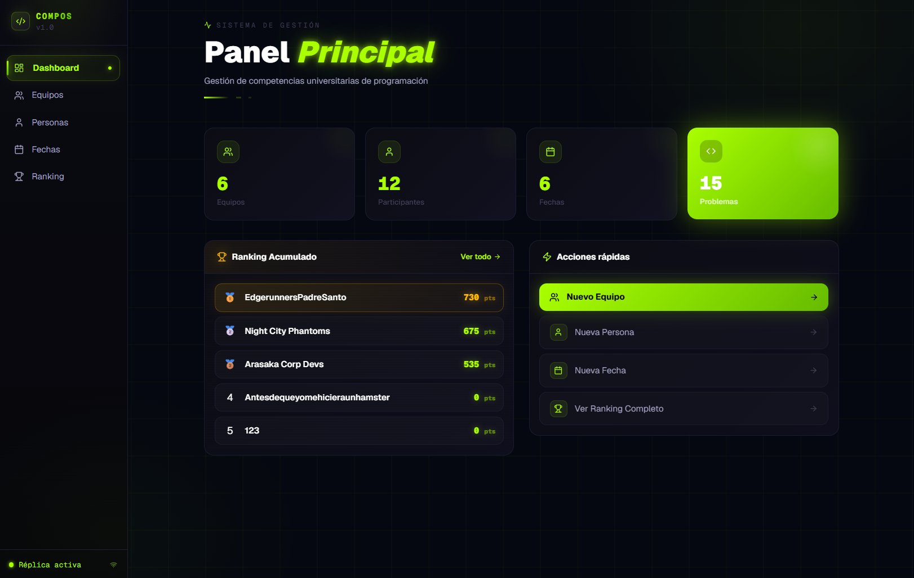

# Distributed Competitive Programming Management System

A full-stack web application for managing university programming competitions, built on a three-node MySQL replication cluster connected over a private VPN mesh.



---

## Architecture Overview

### Physical Nodes

| Node   | Tailscale IP      | Port | Role                |
|--------|-------------------|------|---------------------|
| Node 1 | `100.110.30.15`   | 3306 | Primary Master      |
| Node 2 | `100.113.123.57`  | 3306 | Secondary Master    |
| Node 3 | `100.111.63.7`    | 3306 | Read-only Replica   |

All nodes run **MySQL 8.0 natively** on their respective operating systems (Windows on Nodes 1 and 2, Linux on Node 3).

### Replication Topology

```
Node 1 ←──── Master-Master ────► Node 2
  │
  └──── Master-Slave ────► Node 3
```

- **Node 1 ↔ Node 2:** Bidirectional replication (Master-Master). Both nodes accept writes and propagate changes to each other.
- **Node 1 → Node 3:** Unidirectional replication (Master-Slave). Node 3 receives changes from Node 1 only and serves as a read-only backup.

### Node Connectivity — Tailscale VPN

The three nodes are physically separated across different networks. Inter-node communication is handled by **Tailscale**, a WireGuard-based mesh VPN that assigns each machine a stable private IP (the `100.x.x.x` addresses above), reachable from any other node regardless of physical location or ISP.

---

## Why Docker Was Rejected

The initial design ran Node 2 as a Docker container (port 3307) alongside Node 1 on the same machine. This caused a recurring replication failure: **on container restart, MySQL's replication engine retained a stale binlog position that exceeded the actual file size after the restart**.

```
Got fatal error 1236 from source when reading data from binary log:
'Client requested source to start replication from position > file size'
```

Each restart required manually identifying the correct binlog position and issuing `CHANGE SOURCE TO` with the updated values.

**Decision:** Node 2 was migrated to a dedicated physical machine running native MySQL, eliminating the issue entirely. With native MySQL, binlog files and replication state persist correctly across restarts.

---

## Replication Configuration

### Requirements Per Node

1. **Unique `server_id`:** identifies the node within the cluster. MySQL uses this ID to prevent replication cycles — an event is discarded if its originating `server_id` matches the receiver's own.
2. **Binary logging (`log_bin`):** each node records all write operations in binlog files, which the other nodes consume.
3. **Replication user:** a MySQL account with `REPLICATION SLAVE` privileges used by remote nodes to connect and read the binlog.

### Per-Node Configuration

#### Node 1 — Primary Master (`server_id = 1`)

- `server_id = 1` set in `my.ini` (persists across restarts).
- Binlog enabled: files `MARIOAG-bin.*`.
- Configured as **slave of Node 2**: reads binlog from `100.113.123.57:3306`, filtered to `competencias_programacion` (`Replicate_Do_DB = competencias_programacion`).
- Configured as **master of Node 3**: Node 3 reads from Node 1's binlog.
- `log_slave_updates = ON`: changes received from Node 2 are also written to Node 1's own binlog, ensuring Node 3 receives changes that originated on Node 2.

#### Node 2 — Secondary Master (`server_id = 2`)

- `server_id = 2` set via `SET PERSIST server_id = 2`, stored in `mysqld-auto.cnf` — survives restarts without modifying `my.ini`.
- Binlog enabled: files `DESKTOP-Q6FADEP-bin.*`.
- Configured as **slave of Node 1**: reads binlog from `100.110.30.15:3306` without database filtering.

#### Node 3 — Read-only Replica (`server_id = 3`)

- `server_id = 3` set in `/etc/mysql/my.cnf`.
- Configured as **slave of Node 1**: reads binlog from `100.110.30.15:3306`, filtered to `competencias_programacion`.
- **No binlog enabled** — not a master of any node.
- Accepts no direct application writes.

### Anti-Loop Mechanism (Master-Master)

In a Master-Master topology, a write could theoretically replicate indefinitely: Node 1 writes → replicates to Node 2 → Node 2 replicates back to Node 1, and so on. MySQL prevents this natively: every binlog event carries the `server_id` of its origin. A node discards any event whose `server_id` matches its own, breaking the loop at the source.

### Replication State Persistence

Binlog read positions (file + offset) are persisted in `mysql.slave_relay_log_info` and `mysql.slave_master_info` using `master_info_repository = TABLE`. This guarantees that a MySQL service restart does not lose replication progress.

---

## Database Schema

The `competencias_programacion` database models the following entities:

```
Person ──── Competitor (1:1 optional)
  │
  └──────── TeamMember ─────► Team
                                 │
                                 └─► Result ◄─── RoundProblem
                                                      │
                                      Round         Problem
```

| Table               | Description                                                                      |
|---------------------|----------------------------------------------------------------------------------|
| `persona`           | Any participant (name, unique email)                                             |
| `competidor`        | Extends `persona` with enrollment start/end dates and date of birth              |
| `equipo`            | Team name                                                                        |
| `miembro_equipo`    | N:M relationship between persons and teams, with role (competitor, coach, etc.)  |
| `fecha_competencia` | A competition round: type (`fecha_cero`, `clasificatoria`, `repechaje`) + number |
| `problema`          | Problem statement: name, description, optional theory                            |
| `fecha_problema`    | N:M relationship between rounds and problems                                     |
| `resultado`         | Points scored by a team on a specific problem in a specific round. Composite PK: `(equipo_id, fecha_id, problema_id)` |

---

## Frontend

### Tech Stack

| Component   | Technology                             |
|-------------|----------------------------------------|
| Framework   | Next.js (App Router, production mode)  |
| ORM         | Prisma 5.22.0 + MySQL2                 |
| UI          | Tailwind CSS + Framer Motion           |
| Language    | TypeScript                             |
| Deployment  | Node.js production server (Windows Task Scheduler) |

### Application Modules

| Route       | Description                                                                          |
|-------------|--------------------------------------------------------------------------------------|
| `/`         | Dashboard with animated counters (teams, participants, rounds, problems) and top-5 ranking summary |
| `/equipos`  | Team management — create teams, assign members with roles                            |
| `/personas` | Participant management — register as competitors with academic dates                 |
| `/fechas`   | Round management — create rounds, assign problems per round                          |
| `/ranking`  | Results visualization — cumulative ranking and per-round breakdown                   |

Each module exposes its own REST API under `/api/[module]` via Next.js Route Handlers, connected to the database through Prisma.

### Ranking Calculation

**Cumulative ranking (default):**
- Considers only rounds of type `clasificatoria` (excludes `fecha_cero` and `repechaje`).
- Sums `puntos_obtenidos` across all `resultado` rows per team for qualifying rounds.
- Teams with no results appear with 0 points.
- Response includes a per-round breakdown (`porFecha`) for columnar display.

**Per-round ranking:**
- Filters `resultado` by a specific `fecha_id`.
- Groups by team and sums all problem scores for that round.
- Works for any round type.

The top 3 teams are rendered as an **animated podium** (gold, silver, bronze). Remaining positions appear in a table with per-round columns in cumulative mode.

### Database Connection

The frontend runs on **Node 1 (`100.110.30.15:3000`)** and connects exclusively to the local MySQL instance on that node (`DATABASE_URL` points to `localhost:3306`). Node 1 is the single write entry point for the application.

Prisma uses a global client singleton to reuse connections across requests in the production Node.js environment.

### Replication Health Check

**Endpoint:** `GET /api/replication/health`

Implemented in `src/lib/replication.ts`. Performs two checks in parallel:

1. **IO Thread + SQL Thread status on Node 1:** queries `performance_schema.replication_connection_status` and `performance_schema.replication_applier_status` via Prisma raw query. Both threads must report `SERVICE_STATE = 'ON'`.
2. **TCP ping to Node 2:** opens a TCP connection to `100.113.123.57:3306` with a 3-second timeout.

Replication is considered **healthy** only when all three conditions are met: IO ON + SQL ON + Node 2 reachable.

Results are **cached in memory for 15 seconds** to avoid hitting the database on every HTTP request.

### Write Protection

All write endpoints (`POST`, `PUT`, `DELETE`) call `assertReplicationHealthy()` before processing the request. If replication is unhealthy, the function throws a `ReplicationError` and the endpoint returns **HTTP 503** with the message `"Replicación no disponible — escrituras bloqueadas"`.

**Read endpoints (`GET`) bypass the health check** and remain fully operational even when replication is down, allowing historical data to be consulted while connectivity is restored.

This design prevents data from being written to only one node, preserving cluster consistency.

### Production Deployment

The application runs in production mode (`npm run build && npm start`) on Node 1. A **Windows Task Scheduler** job named `CompOS-Prod` starts the process automatically at system boot (trigger: `ONSTART`, account: `SYSTEM`), requiring no manual intervention after restarts.

Process logs are written to `server.log` in the application directory.

---

## Write Flow

End-to-end flow for a write operation (e.g., submitting a team's score):

```
Client (browser)
    │  POST /api/resultados { equipo_id, fecha_id, problema_id, puntos_obtenidos }
    ▼
Next.js — Node 1 (100.110.30.15:3000)
    │  assertReplicationHealthy() → checks IO+SQL ON and Node 2 reachable
    │  Unhealthy → HTTP 503
    ▼
MySQL — Node 1 (localhost:3306)
    │  UPSERT into resultado table
    │  Event written to binlog
    ▼
    ├── Node 2 (100.113.123.57:3306) — reads Node 1 binlog
    │       SQL Thread applies INSERT/UPDATE → data replicated
    │
    └── Node 3 (100.111.63.7:3306) — reads Node 1 binlog
            SQL Thread applies INSERT/UPDATE → data replicated
```

---

## System Summary

| Property                        | Value                                         |
|---------------------------------|-----------------------------------------------|
| Total nodes                     | 3                                             |
| Topology                        | Master-Master (N1↔N2) + Master-Slave (N1→N3) |
| Inter-node connectivity         | Tailscale VPN (WireGuard)                     |
| Database engine                 | MySQL 8.0 native (no Docker)                  |
| Replicated database             | `competencias_programacion`                   |
| Anti-loop mechanism             | Native MySQL `server_id` filtering            |
| Replication state persistence   | `master_info_repository = TABLE`              |
| Frontend framework              | Next.js + Prisma 5.22.0                       |
| Write entry point               | Node 1 (`100.110.30.15:3000`)                 |
| Health check                    | IO Thread + SQL Thread + TCP ping to Node 2   |
| Health check cache TTL          | 15 seconds (in-memory)                        |
| Replication down — reads        | Fully operational                             |
| Replication down — writes       | Blocked (HTTP 503)                            |
